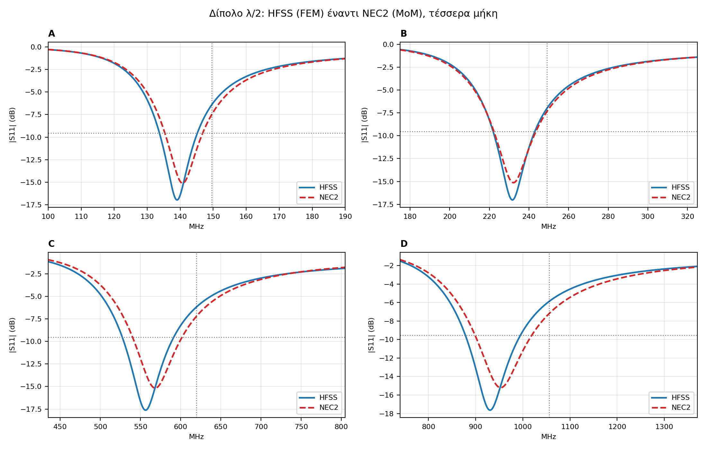
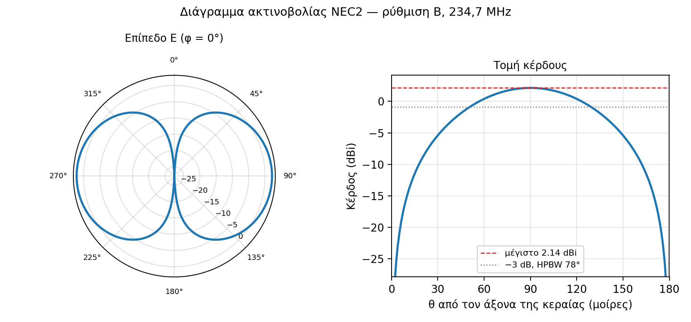

# Half-wave dipole: simulation vs. measurement

S11 of a telescopic half-wave dipole at four element lengths, modelled independently with
two different numerical methods and (next step) measured with a NanoVNA-F V2.

The point of the project is not to make the three numbers agree. It is to explain, with
numbers, why they differ.

**Status:** simulation and cross-validation complete. Measurement pending — the measurement
columns in the tables below are placeholders.



## 1. Theory

An ideal half-wave dipole resonates when its total length ℓ equals λ/2:

```
f₀ = c / (2ℓ)        ℓ = 2L + g
```

where `L` is the length of each arm from the base and `g` is the feed gap. A real dipole made
of finite-thickness arms resonates lower than `f₀`, and the shift grows as the arms get thicker
relative to the length. The shift is often quoted as 3–5%; that figure applies to thin wire.
For telescopic whips it is considerably larger, as shown below.

## 2. Geometry and setups

Two solid PEC cylinders on the z axis, separated by a feed gap `g`, fed by a lumped port sheet
spanning the gap. The model is fully parametric in HFSS (`L`, `g`, `r_arm`, `pad`), so the four
setups are the same design re-evaluated at different variable values.

| Setup | Arm L (mm) | Arm radius r (mm) | ℓ = 2L + g (mm) | ℓ / 2r | Ideal f₀ (MHz) |
| --- | --- | --- | --- | --- | --- |
| A | 500 | 2.5 | 1002 | 200 | 149.6 |
| B | 300 | 2.5 | 602 | 120 | 249.0 |
| C | 120 | 2.0 | 242 | 60 | 619.4 |
| D | 70 | 2.0 | 142 | 36 | 1055.6 |

Feed gap `g` = 2 mm in every setup. A and B use the kit's large telescopic elements, C and D
the small ones. Arm radius is the assumed mean radius of the telescopic sections; it will be
replaced with caliper measurements before the measurement stage, which is expected to move the
resonances by 1–3% (see §7).

## 3. Method 1 — Ansys HFSS (finite element method)

- Solution type: Modal, driven
- Radiation boundary on an air region offset by `pad` ≈ λ/4 at the low end of each sweep
- Lumped port, 50 Ω, integration line across the gap
- Adaptive mesh to Maximum Delta S = 0.01, up to 25 passes
- Interpolating frequency sweep, 0.1 MHz step

## 4. Method 2 — NEC2 (method of moments)

The same four dipoles were solved independently with NEC2 via
[PyNEC](https://pypi.org/project/PyNEC/) (`sim_dipole_nec.py`). NEC2 is a thin-wire method of
moments code — a completely different formulation from HFSS's finite elements — so agreement
between the two is meaningful evidence that the model is right, not just that it converged.

Segmentation: odd segment count, Δ < λ/20 at the top of the sweep and Δ > 2.5·r so the extended
thin-wire kernel stays valid, capped at 101 segments.

The NEC2 radiation pattern for setup B is the expected dipole doughnut, at **2.14 dBi** with a
**78° half-power beamwidth**. Textbook values for an ideal half-wave dipole are 2.15 dBi and 78°.



## 5. Mesh convergence — why the first HFSS run was wrong

The first solution of setup A stopped at Delta S = 0.0196 after 15 passes, just inside the
0.02 criterion, and put the resonance at **137.73 MHz**. That looked acceptable in isolation.

It was caught by a consistency check rather than by the solver. Setups A and B share the same
arm radius but differ in length, so B is electrically thicker and must resonate relatively
*lower*; the ratio f_B / f_A therefore has to come out below the pure-scaling value of
ℓ_A / ℓ_B = 1.6645. The first run gave 1.6788 — on the wrong side.

Re-solving both setups with Maximum Delta S = 0.01 moved A by +1.32 MHz (+0.96%) and B by only
+0.41 MHz (+0.18%), which halved the disagreement with NEC2 for A:

| Setup | Delta S = 0.02 | Delta S = 0.01 | vs. NEC2, before → after |
| --- | --- | --- | --- |
| A | 137.73 MHz | 139.05 MHz | −2.13% → −1.19% |
| B | 231.22 MHz | 231.63 MHz | −0.40% → −0.23% |

The ratio test now gives 1.666 against a limit of 1.6645. That is still 0.08% on the wrong side,
which is too small to carry any meaning — the test was useful while the error was ~1%, and is
exhausted now. All four setups in this repo use Delta S = 0.01.

The corresponding check on the NEC2 side is segmentation. Sweeping the segment count from 15 to
61 moves the resonance by less than 0.1% for setup C and 0.25% for setup D, so the NEC2 numbers
are not limited by discretisation either.

## 6. Results

| Setup | Ideal f₀ (MHz) | HFSS (MHz) | NEC2 (MHz) | HFSS vs NEC2 | Shortening, HFSS | Shortening, NEC2 | \|S11\| min (dB) | R from depth (Ω) | BW, VSWR<2 |
| --- | --- | --- | --- | --- | --- | --- | --- | --- | --- |
| A | 149.6 | 139.05 | 140.72 | −1.19% | −7.1% | −5.9% | −16.96 | 66.5 | 11.5 MHz (8.3%) |
| B | 249.0 | 231.63 | 232.16 | −0.23% | −7.0% | −6.8% | −17.02 | 66.4 | 21.0 MHz (9.1%) |
| C | 619.4 | 556.34 | 568.34 | −2.11% | −10.2% | −8.2% | −17.62 | 65.1 | 63.9 MHz (11.4%) |
| D | 1055.6 | 930.50 | 952.95 | −2.36% | −11.9% | −9.7% | −17.64 | 65.1 | 116.6 MHz (12.5%) |

NEC2 puts the input resistance at 72.0, 72.2, 72.6 and 73.2 Ω for A–D, with |S11| minima all
near −15.1 dB.

Per-setup plots: [A](plots/A_hfss_vs_nec.png) · [B](plots/B_hfss_vs_nec.png) ·
[C](plots/C_hfss_vs_nec.png) · [D](plots/D_hfss_vs_nec.png). Machine-readable summary in
[`data/results_summary.csv`](data/results_summary.csv).

## 7. Discussion

**The shortening is much larger than the textbook 3–5%.** It runs from −7% for the longest,
thinnest setup to −11.9% for the shortest, thickest one, and both methods reproduce the trend.
The quoted 3–5% is a thin-wire figure; at ℓ/2r = 36 the arms are nowhere near thin.

**The input resistance offset is systematic, not noise.** HFSS returns 65–66.5 Ω in all four
setups while NEC2 returns 72–73 Ω. A constant offset across four independent geometries points
at the feed model: HFSS solves a real 2 mm gap bridged by a port sheet, with its own
capacitance, while NEC2 applies an ideal delta-gap source to one wire segment. The two are
solving slightly different antennas at the feed, and the resistance is where that shows.

**C and D disagree more (≈2%) than A and B, which is expected.** NEC2 is a thin-wire code. At
ℓ/2r = 36 the thin-wire approximation is near the edge of its validity, and the segmentation
sweep in §5 shows the residual is not numerical. For the two short setups, HFSS is the more
trustworthy of the two.

**One thing that does not fit.** If arm thickness were the whole story, the HFSS–NEC2 gap would
grow monotonically from A to D. It does not: B agrees to 0.23%, better than A at 1.19%. No
explanation is offered here, because none has been established. Re-solving A at Delta S = 0.005
would show whether residual mesh sensitivity accounts for it.

**What the measurement is expected to add.** Two effects are in neither simulation. The kit's
telescopic arms are tapered rather than uniform cylinders, and the assumed radius is not yet a
measured one. More importantly, the kit has no balun, so current flows on the outside of the
coax braid and the feed cable becomes part of the antenna. The cable experiment in §8 is
designed to isolate that.

## 8. Measurement — pending

Planned with a NanoVNA-F V2 (50 kHz–3 GHz), OSL-calibrated at the cable end, antenna on a tripod
at least 1 m clear of walls and railings:

- three connect/disconnect repeats per setup, for repeatability
- hand on the cable, clamp-on ferrite at the base, cable parallel to one arm — the common-mode
  current experiment, on setups A and B where the effect is strongest

| Setup | HFSS (MHz) | Measured (MHz) | Deviation |
| --- | --- | --- | --- |
| A | 139.05 | — | — |
| B | 231.63 | — | — |
| C | 556.34 | — | — |
| D | 930.50 | — | — |

## 9. Repository

```
dipole-sim-vs-measurement/
  README.md
  sim_dipole_nec.py      NEC2 model, writes data/<S>_nec.csv and the sensitivity plots
  analyze_dipole.py      reads HFSS/NEC2/Touchstone, writes plots/<S>_s11.png and the table
  data/                  <S>_hfss.csv, <S>_nec.csv, results_summary.csv, <S>_meas_*.s1p
  hfss/                  dipole.aedt
  plots/                 per-setup comparisons, all_setups.png, radiation_pattern.png
  photos/                measurement setup
```

## 10. Reproducing

```bash
pip install numpy scipy matplotlib scikit-rf PyNEC
python sim_dipole_nec.py     # re-runs the NEC2 model for all four setups
python analyze_dipole.py     # rebuilds the plots and prints the results table
```

`analyze_dipole.py` reads the frequency unit from the csv header, so HFSS exports in MHz or GHz
both work. It runs before any measurement exists; the measurement columns simply stay empty.

## References

- C. A. Balanis, *Antenna Theory: Analysis and Design*, 4th ed., ch. 4 — dipole resonance and
  the length/thickness dependence
- G. J. Burke and A. J. Poggio, *Numerical Electromagnetics Code (NEC) — Method of Moments*,
  Lawrence Livermore National Laboratory, 1981 — thin-wire kernel and segmentation limits
- Ansys HFSS documentation — adaptive meshing and the Delta S convergence criterion
