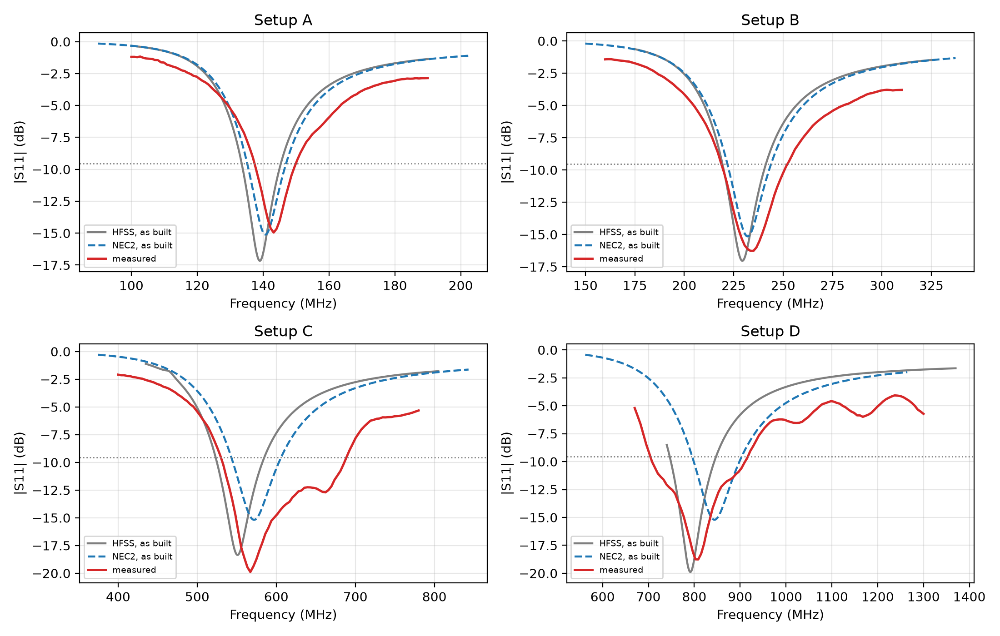
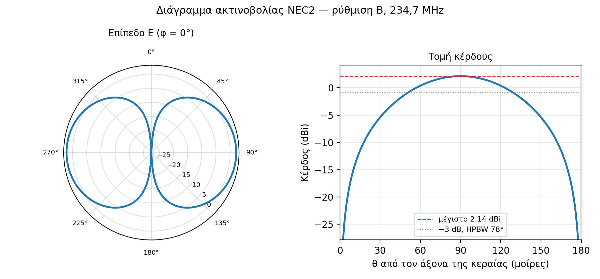
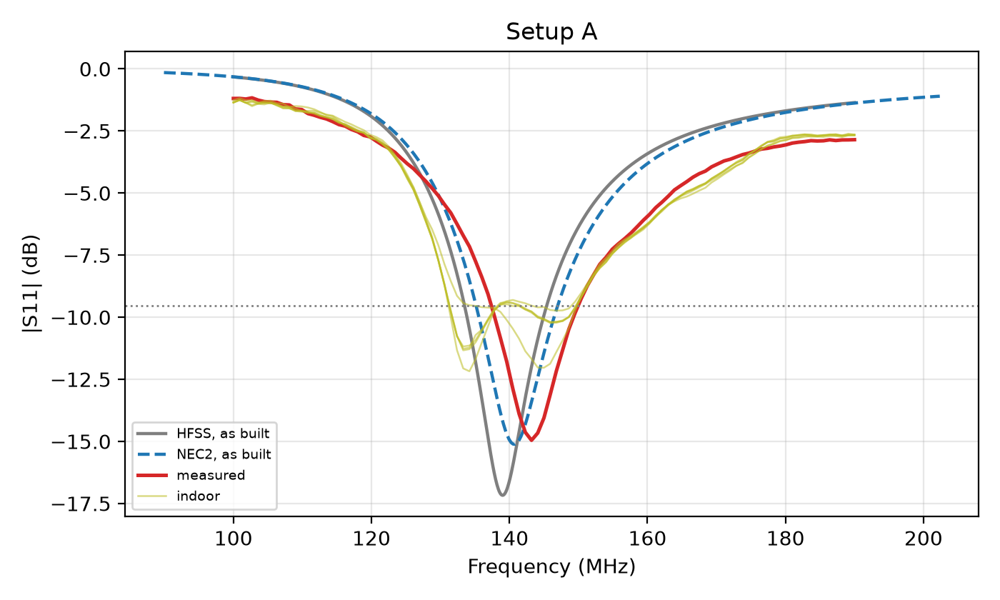

# Half-wave dipole: simulation against measurement

S11 of a telescopic half-wave dipole at four element lengths, modelled independently with two
different numerical methods and then measured with a NanoVNA-F V2.

The point of the project is not to make the three numbers agree. It is to explain, with
numbers, why they differ, and to say where the remaining disagreement is not yet explained.

**Status:** complete. Simulation, cross-verification and measurement are all in the repository.
Four setups measured on 21 September 2026 on a roof in Thessaloniki, one calibration per setup.



## 1. Theory

An ideal half-wave dipole resonates when its total span ℓ equals λ/2:

```
f₀ = c / (2ℓ)        ℓ = 2L + g
```

where `L` is the length of each arm and `g` is the feed gap. A real dipole made of
finite-thickness arms resonates lower than `f₀`, and the shift grows as the arms get thicker
relative to the length. The shift is usually quoted as 3–5%; that figure applies to thin wire.
For telescopic whips it is two to three times larger, as shown below.

Thickness does two things at once, and both are visible in the data: it lowers the resonance,
and it widens the bandwidth. They are the same cause — a thicker arm has lower characteristic
impedance, so the reactance climbs more slowly away from resonance — so a setup that is shifted
further down must also be broader, and that internal consistency is one of the checks used here.

## 2. Geometry

The antenna is a kit of two telescopic whips screwed into a plastic block. Two things about it
are not textbook, and the accuracy of everything downstream depends on how they are handled.

**The arms are tapered and only partly extended.** The large element runs from 6.00 mm diameter
at the base to 2.80 mm at the tip and extends from 230 to 1000 mm; the small element runs from
4.85 to 2.13 mm and extends from 50 to 130 mm. Collapsed length is the length of the base tube,
so a partly extended whip is a fat cylinder with a thin taper on the end, not a uniform rod.
`sim_dipole_nec.py` builds that profile and reduces it to one equivalent radius as
exp(⟨ln r⟩) along the arm, because the thin-wire kernel enters the integral equation as
ln(segment/radius) — the radius that matters is the one whose logarithm is the average.

**The feed gap is 21.83 mm**, measured metal to metal across the block. That is 2% of setup A
and 14% of setup D. NEC2 drives one segment of a continuous wire, so the gap cannot be modelled
as a gap; what can be done is to run the model twice, once with the gap counted as conductor
(span = 2L + g) and once not (span = 2L), and treat the pair as a bracket on the answer.

As built, on the roof:

| Setup | Span ℓ (mm) | Arm L (mm) | Equivalent radius (mm) | ℓ / 2r | Element | Ideal f₀ (MHz) |
| --- | --- | --- | --- | --- | --- | --- |
| A | 1000 | 489.1 | 2.85 | 175 | large | 149.9 |
| B | 600 | 289.1 | 2.99 | 100 | large | 249.8 |
| C | 240 | 109.1 | 2.13 | 56 | small | 624.6 |
| D | 160 | 69.1 | 2.38 | 34 | small | 936.9 |

Setup B is *thicker* than setup A in the sense that matters, even though both use the same
element: B is extended less, so more of its length is base tube.

Setup D was planned at 140 mm and built at 160 mm. 160 mm is the better build — it keeps the
small element off its collapsed end stop, where the sections make poor contact — and the sweep
covered it, so the change was kept rather than undone.

## 3. Method 1 — Ansys HFSS (finite element method)

- Solution type: Modal, driven
- Radiation boundary on an air region offset by `pad` ≈ λ/4 at the low end of each sweep
- Lumped port, 50 Ω, integration line across the gap
- Adaptive mesh to Maximum Delta S = 0.01, up to 25 passes
- Interpolating frequency sweep, 0.1 MHz step

The HFSS model was built and solved before the kit was measured with a caliper, so it carries
the **nominal** geometry: uniform arms of 2.0 or 2.5 mm radius and a 2 mm feed gap. It is kept
in this repository as the cross-verification of NEC2 (§5) and is plotted for reference, but it
is not the simulation that the measurement is compared against. Re-solving it at the as-built
geometry is the first item under "not finished" in §8.

## 4. Method 2 — NEC2 (method of moments)

The four as-built dipoles were solved with NEC2 via [PyNEC](https://pypi.org/project/PyNEC/)
(`sim_dipole_nec.py`). NEC2 is a thin-wire method of moments code — a completely different
formulation from HFSS's finite elements — so agreement between the two is evidence that the
model is right, not just that it converged.

Segmentation: odd segment count, Δ < λ/20 at the top of the sweep and Δ > 2.5·r so the extended
thin-wire kernel stays valid, capped at 101 segments.

The NEC2 radiation pattern for setup B is the expected dipole doughnut, at **2.14 dBi** with a
**78° half-power beamwidth**. Textbook values for an ideal half-wave dipole are 2.15 dBi and 78°.



NEC2, as built:

| Setup | f at X = 0 (MHz) | R at X = 0 (Ω) | f at min \|S11\| (MHz) | Shortening vs f₀ | Feed-gap bracket (MHz) | Equivalent-radius bracket (MHz) |
| --- | --- | --- | --- | --- | --- | --- |
| A | 141.6 | 72.1 | 140.7 | −6.1% | 140.7 … 143.8 | 140.6 … 142.2 |
| B | 234.0 | 72.3 | 232.1 | −7.1% | 232.1 … 240.6 | 232.0 … 235.3 |
| C | 578.5 | 72.6 | 572.0 | −8.4% | 572.0 … 627.5 | 569.8 … 581.5 |
| D | 857.7 | 73.2 | 844.1 | −9.9% | 844.1 … 972.2 | 843.6 … 864.4 |

The equivalent-radius bracket is the whole plausible range — every arm modelled at its base
radius, then every arm at its tip radius — and it is under 2.5% wide even for setup D. The
tapered-arm model is therefore not where the uncertainty lives. The feed-gap bracket is much
wider and is where it does live, for the two short setups.

## 5. Mesh convergence — why the first HFSS run was wrong

The first solution of setup A stopped at Delta S = 0.0196 after 15 passes, just inside the 0.02
criterion, and put the resonance at **137.73 MHz**. That looked acceptable in isolation.

It was caught by a consistency check rather than by the solver. Setups A and B share the same
arm radius but differ in length, so B is electrically thicker and must resonate relatively
*lower*; the ratio f_B / f_A therefore has to come out below the pure-scaling value of
ℓ_A / ℓ_B = 1.6645. The first run gave 1.6788 — on the wrong side.

Re-solving both setups with Maximum Delta S = 0.01 moved A by +1.32 MHz (+0.96%) and B by only
+0.41 MHz (+0.18%), which halved the disagreement with NEC2 for A:

| Setup | Delta S = 0.02 | Delta S = 0.01 | vs. NEC2, before → after |
| --- | --- | --- | --- |
| A | 137.73 MHz | 139.05 MHz | −2.13% → −1.19% |
| B | 231.22 MHz | 231.63 MHz | −0.40% → −0.23% |

The same ratio test applied to the measurement, where nothing is assumed about the model at all:
the measured f_B / f_A is **1.636** against the pure-scaling limit of 1.667, so the measurement
satisfies the test with room to spare. The C/D pair gives 1.421 against a limit of 1.500.

The corresponding check on the NEC2 side is segmentation. Sweeping the segment count from 15 to
61 moves the resonance by less than 0.1% for setup C and 0.25% for setup D, so the NEC2 numbers
are not limited by discretisation either.

## 6. Measurement

NanoVNA-F V2, 50 kHz – 3 GHz. OSL calibration at the end of the cable, repeated for every
setup, 101 points per sweep. The antenna was on a roof, horizontal, at least 1 m clear of
railings and walls, with the feed cable led away perpendicular to the arms for as far as it
would go.

**How much cable is still in the reference plane.** A lossless line does not change |S11|, only
its phase, so the phase of Γ rotates at a rate set by the round trip. Taking the median phase
step across the sweep — away from resonance, where the antenna's own reactance dominates the
rotation — gives the line length left in front of the calibration plane:

| Setup | A | B | C | D |
| --- | --- | --- | --- | --- |
| One-way line length (m) | 1.31 | 1.17 | 1.23 | 1.22 |

The four agree to ±6%, which is what makes them one consistent measurement rather than four.
The residual line does not move the resonance, because it does not change |Γ|, but its loss
deepens every dip and its outer braid carries common-mode current (§7).

**Indoors is not a measurement.** Five repeats of setup A taken indoors the day before are kept
in `data/A_meas_indoor*.s1p` and plotted in grey:



Indoors the antenna shows two or three shallow dips between 133 and 147 MHz, none deeper than
−12.2 dB, and which one is deepest changes between connect/disconnect cycles — the frequency of
minimum |S11| jumps from 144.6 to 133.7 MHz across five runs of the same antenna. On the roof
there is one dip, at 143.22 MHz, and it is 2.8 dB deeper than anything seen indoors. The indoor
runs are in the repository because the failure is the useful part: a number extracted from them
would have looked like a measurement.

## 7. Results

| Setup | HFSS, nominal (MHz) | NEC2, as built (MHz) | Measured (MHz) | Measured vs NEC2 | Depth (dB) | BW VSWR<2, measured | BW VSWR<2, NEC2 | Q |
| --- | --- | --- | --- | --- | --- | --- | --- | --- |
| A | 139.05 | 140.70 | **143.22** | +1.79% | −14.95 | 12.6 MHz (8.7%) | 11.8 MHz (8.4%) | 8.1 |
| B | 231.63 | 232.06 | **234.25** | +0.95% | −16.27 | 33.4 MHz (14.2%) | 22.1 MHz (9.5%) | 5.0 |
| C | 556.34 | 571.97 | **567.10** | −0.85% | −19.89 | 158.9 MHz (26.1%) | 63.0 MHz (11.0%) | 2.7 |
| D | 930.50 | 844.11 | **805.60** | −4.56% | −18.76 | 212.9 MHz (26.3%) | 108.2 MHz (12.7%) | 2.7 |

Machine-readable summary in [`data/results_summary.csv`](data/results_summary.csv). Per-setup
plots: [A](plots/A_s11.png) · [B](plots/B_s11.png) · [C](plots/C_s11.png) · [D](plots/D_s11.png).

## 8. Discussion

**Three setups agree with the model to better than 2%.** A, B and C land at +1.79%, +0.95% and
−0.85% of the NEC2 prediction for the as-built geometry, with no parameter fitted to the
measurement. The shortening from the ideal λ/2 length runs from −4.5% measured for A to −14%
for D, against the 3–5% that textbooks quote for thin wire.

**The disagreement is monotonic in thickness, and that is the interesting result.**

| Setup | ℓ / 2r | Measured − NEC2 |
| --- | --- | --- |
| A | 175 | +1.79% |
| B | 100 | +0.95% |
| C | 56 | −0.85% |
| D | 34 | −4.56% |

The deviation falls smoothly as the elements get fatter, and it changes sign. A fixed error —
a few millimetres of unmodelled metal at the feed, say — would not do that: fitting one to the
four setups needs −17.6, −5.5, +4.9 and +7.6 mm respectively, which is not one number. What
does vary in exactly this way is the validity of the two approximations that NEC2 is making
here: the thin-wire kernel, which is asymptotic in ℓ/2r, and the delta-gap source standing in
for a feed gap that is 2% of setup A and 14% of setup D. Both get worse in the same direction
as the element gets fatter, and this measurement cannot separate them.

The HFSS runs, at nominal geometry, disagree with NEC2 in the same direction for the same
setups — −2.11% for C and −2.36% for D, against −1.19% and −0.23% for A and B — so the finite
element solver, which models the gap as a real gap and the arm as a real cylinder, also says
NEC2 puts thick dipoles too high. The measurement sides with HFSS, and for D goes further than
HFSS does.

**What would settle it:** re-solve all four in HFSS at the as-built geometry, with the 21.83 mm
gap modelled explicitly. If the HFSS curve follows the measurement down for D, the feed model
is the cause; if it does not, the thin-wire kernel is. That run is not in this repository.

**The bandwidth agrees where the trace is clean and not where it is not.** For A the measured
VSWR<2 bandwidth is 12.6 MHz against 11.8 predicted, a 7% excess that is the right size for
conductor and contact loss in a telescopic whip. For C and D the measured bandwidth is two and a
half times the prediction, and the traces show why: they never return to 0 dB. Setup D is below
−4 dB across the whole 670–1300 MHz sweep, where a 160 mm dipole should be almost totally
reflective at both ends. Power is leaving somewhere other than the antenna.

**The dips are deeper than they should be, which is not good news.** NEC2 puts the input
resistance at 72–73 Ω for all four setups, which is a −15.1 dB minimum against 50 Ω. Setup A
measures 0.2 dB shallower than that; B, C and D measure 1.1, 4.7 and 3.6 dB *deeper*.
Attenuation between the calibration plane and the antenna subtracts twice the one-way loss from
the return loss, so a lossy path makes a mismatched antenna look well matched, and the three
setups above 200 MHz are all on that side. The consequence is that **the
input resistance cannot be recovered from these measurements**: de-embedding needs the cable's
loss and length to be known, and 10 cm of assumed length moves setup D's resonance by 20 MHz.

**There is no balun.** The kit feeds a balanced antenna from unbalanced coax, so current flows
on the outside of the braid and the cable becomes part of the radiating structure. That is the
most likely source of both the missing reflection off resonance and the ripples in the C and D
traces, whose spacing (roughly 150 MHz for D) corresponds to a line of the order of a metre —
the length the phase slope measures in front of the calibration plane. The experiment
that would confirm it — a clamp-on ferrite at the feed, and the cable re-routed parallel to one
arm — was planned and not done; the roof session was a single pass with one calibration per
setup and no repeats.

**What is missing.** One measurement per setup, so there is no repeatability figure for the
roof session; the five indoor repeats of setup A are all that exist, and they measure the room
rather than the antenna. No ferrite or cable-routing experiment. No HFSS at as-built geometry.

## 9. Measuring the same antennas with an SDR

The same four antennas were swept with an RTL-SDR Blog V4 in
[sdr-spectrum-analyzer](https://github.com/ioannidisphysics/sdr-spectrum-analyzer), comparing
the receiver's noise floor with the antenna connected against a 50 Ω load, which should peak
where the antenna is matched. **It did not work**, and the reason is written up there: the
antenna raised the floor by less than 1 dB, so the receiver's own noise figure, not the antenna,
set what was measured. The VNA numbers in this repository are the ones that stand.

## 10. Repository

```text
dipole-sim-vs-measurement/
  README.md
  sim_dipole_nec.py      NEC2 model of the as-built geometry, writes data/<S>_nec.csv
  analyze_dipole.py      reads HFSS/NEC2/Touchstone, writes the plots and the tables
  data/                  <S>_hfss.csv, <S>_nec.csv, <S>_meas_*.s1p, results_summary.csv
  hfss/                  dipole.aedt
  plots/                 per-setup comparisons, all_setups.png, radiation_pattern.png
```

Measurement files are Touchstone `.s1p`, real/imaginary, 50 Ω reference:
`<S>_meas_1.s1p` is the roof measurement, `<S>_meas_indoor*.s1p` the indoor repeats.

## 11. Reproducing

```bash
pip install numpy scipy matplotlib scikit-rf PyNEC
python sim_dipole_nec.py     # re-runs NEC2 for all four setups and prints the geometry table
python analyze_dipole.py     # rebuilds the plots and prints the results tables
```

`analyze_dipole.py` reads the frequency unit from the csv header, so HFSS exports in MHz or GHz
both work, and it runs with any subset of the measurements present.

## References

- C. A. Balanis, *Antenna Theory: Analysis and Design*, 4th ed., ch. 4 — dipole resonance and
  the length/thickness dependence
- G. J. Burke and A. J. Poggio, *Numerical Electromagnetics Code (NEC) — Method of Moments*,
  Lawrence Livermore National Laboratory, 1981 — thin-wire kernel and segmentation limits
- Ansys HFSS documentation — adaptive meshing and the Delta S convergence criterion
